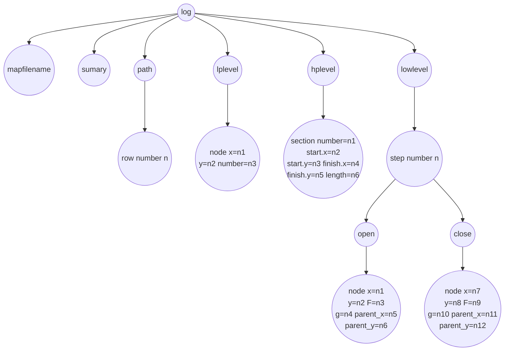

## 20210705

1. 学习程序：从MissionHandler到Thetastar是怎么调用的？

   * MissionBase基类定义了初始化、参考轨迹、规划、控制、获取目标、获取状态、暂停、恢复等虚函数，分电梯，充电桩，通道，平层导航等情况单独写成MissionBase的子类并重载planProcess方法。
   * 枚举类MissionMode定义了NormalNav,Gate,Recharge,Tracking...等。
   * MissionHandle私有成员：map<MissionMode, std::unique_ptr<MissionBase>> m_missions和atomic<MissionMode> m_mission_mode。
   *  MissionHandle中makePlan函数中通过用m_mission_mode在map（m_missions）中找出对应的unique_ptr再调用其planProcess方法。m_missions.at(m_mission_mode)->planProcess(m_cur_pose, speed,m_static_map,aux_data);
   * 以NormalNav为例，它的planProcess方法里根据switch (m_normal_nav_status)进行了startAlignTask，normalTask，moveTask,rotateTask,terminusAlignTask,ALOGE,ALOGD。其中startAlignTask中调用了thetastar:m_indoor_planner->startThetaStar();
2. 阅读论文：The Dynamic Window Approach to Collision Avoidance 
   * 搜索空间
     * 圆弧轨迹：考虑一系列圆弧轨迹组合，定义二维的速度搜索空间。
     * 允许速度：考虑一个制动过程，按照制动减速度计算到距离最近的障碍物时可以停车计算得到的制动初速度为对应弧线的允许速度。$V_a=\left\{(v,\omega)|v{\leq}\sqrt{2{\cdot}dist(v,\omega){\cdot}\dot{v_b}}\land\omega{\leq}\sqrt{2{\cdot}dist(v,\omega){\cdot}\dot{\omega_b}}\right\}$
     * 动态窗口：在一个很短的时间段内可以到达的速度和角速度$\{[v-{\Delta}v,v+{\Delta}v],[\omega-{\Delta}\omega,\omega-{\Delta}\omega]\}$，体现了有界的加速度作用。$V_d=\left\{(v,\omega)|v\in[v_a-\dot{v}{\cdot}t,v_a+\dot{v}{\cdot}t]\land\omega\in[\omega_a-\dot{\omega}{\cdot}t,\omega_a+\dot{\omega}{\cdot}t]\right\}$
   * 优化:$G()=\sigma({\alpha}{\cdot}heading(v,\omega)+\beta{\cdot}dist(v,\omega)+\gamma{\cdot}velocity(v,\omega))$最大
     * 目标航向：定义为$180-\theta$，$\theta$是预测状态的机器人朝向于目标方向之间的夹角，当机器人径直朝向目标时为0。
     * 距离障碍物距离：轨迹到最近障碍物的距离。
     * 速度。

## 20210706

1.学习程序DwaPlanner

* 允许速度的实现：遍历轨迹，将不符合速度约束的跳过别的进入一新容器。

  ```
  for (int i = 0; i < sample_trajs.size(); i++) {
          Eigen::Vector2f sample_speed = sample_trajs[i].wayPoint(0).vel;
          if (sample_speed[0] < v_min || sample_speed[0] > v_max
              || sample_speed[1] < w_min || sample_speed[1] > w_max) {
              continue;
          }
          useful_traj.emplace_back(sample_trajs[i]);
          collision_zones.emplace_back(trajs_collison_zone[i]);
      }
  ```

* 计算total cost:

  ```
  total_cost =cost_weight[0] * traj_dist_cost +cost_weight[1] * collision_cost +cost_weight[2] * 			            oscillation_cost +cost_weight[3] * orientation_cost;
  ```

  

* 寻找cost最大的轨迹：

  ```
    double cost_temp = 1e8;
      int id_temp = -1;
  
      for (int i = 0; i < useful_trajs.size(); i++){
          bool is_cost_valid = collision_cost_raw[i] < COLLISION_COST_MAX - 0.01f;
          bool is_orientation_valid = orientation_cost_raw[i] < m_max_orientation_offset;
          bool is_distance_valid = distance_terminal_to_reftraj[i] < m_max_dist_offset;
          if (cost_temp > total_cost[i] && is_cost_valid && is_orientation_valid && is_distance_valid) {
              cost_temp = total_cost[i];
              id_temp = i;
          }
  return id_temp;
  ```


2. 阅读论文：Trajectory modification considering dynamic constraints of autonomous robots
   * TEB将一系列路径点组成的初始路径转化为显示依赖时间变量的轨迹从而实时的控制机器人，解决环境动态变化的局部规划问题。
   * Timed Elastic Band:位姿$Q=\{x_i\}_{i=0...n}$，时间$\tau=\{{\Delta}T_i\}_{i=0...n-1}$，TEB定义序列同时含有位姿和时间$B:=(Q,\tau)$，然后优化：$minf(B)=min\{\sum_{k}\gamma_kf_k(B)\}$
     * TEB cost函数：分段连续，可微$e_\Gamma(x,x_r,\epsilon,S,n){\simeq}\left\{\begin{aligned}\left(\frac{x-(x_r-\epsilon)}{S}\right)^n&&if{\quad}x>x_r-\epsilon\\0&&{otherwise}\end{aligned}\right\}$
   * 路径点和障碍物:路径点使橡皮筋合并吸引，障碍物使橡皮筋排斥。$f_{path}=e_\Gamma(d_{min,j},r_{p_{max}},\epsilon,S,n)$，$f_{ob}=e_\Gamma(-d_{min,j},-r_{p_{max}},\epsilon,S,n)$，其梯度可以解释为作用在橡皮筋上的外力。
   * 速度和加速度:$v_i\simeq\frac{1}{{\Delta}T_i}\parallel\left(\begin{array}{1}x_{i+1}-x_i\\y_{i+1}-y_i\end{array}\right)\parallel$，$\omega_i\simeq\frac{\beta_{i+1}-\beta{i}}{{\Delta}T_i}$，$a_i=\frac{2（v_{i+1}-v_i）}{{\Delta}T_i+{\Delta}T_{i+1}}$
   * 非完整运动学：$f_k(x_i,x_{i+1})=\parallel{\left[\left(\begin{matrix}\cos\beta_i\\\sin\beta_i\\0\end{matrix}\right)+\left(\begin{matrix}\cos\beta_{i+1}\\\sin\beta_{i+1}\\0\end{matrix}\right)\right]\times\left(\begin{matrix}x_{i+1}-x_i\\y_{i+1}-y_i\\0\end{matrix}\right)}\parallel^2$
   * 最快路径：

## 20210707

1. CCBS算法的可视化问题：现在输出为XML格式
   * 找出现在程序中输出的格式规范
   * Qt工具ASearchVisualizer可以可视化自己example文件夹中的xml。
2. g2o:general graph optimization
   * 选择一个线性方程求解器：从PCG，CSparse，Choldmod中选
   * 选择一个BlockSolver
   * 选择一个迭代测量，从Gauss-Newton,Levernberg-Marquardt,Powell's dogleg中选。

##  20210708 

1. Qt：ASearchVisualizer程序：输入xml文件，鼠标滑动进度条展示寻路算法的状态。进度条头为算法的起点，进度条尾为算法的重点。

   * 程序是通过集成tinyxml开源C++的xml解析程序和QT的图窗，进度条等控件实现可视化。
   * 

2. Python:libMultiRobotPlanning程序：输入两个yaml文件，map_obstacke和 algorighm output输出为matplotlib库做的animation。

   * yaml库：解析yaml文件
   * matplotlib库：画图
   * argparse库：解析命令行输入
   * 使用方式是在命令行输入：python3 ../example/visualize.py ../benchmark/32x32_obst204/map_32by32_obst204_agents10_ex1.yaml output.yaml
   * 

##  20210709

1. Qt:tinyxml库：
   * TiXmlBase：整个TinyXML模型的基类。
     TiXmlAttribute：对应于XML中的元素的属性。
     TiXmlNode：对应于DOM结构中的节点。
     TiXmlComment：对应于XML中的注释。
     TiXmlDeclaration：对应于XML中的申明部分，即<？versiong="1.0" ?>。
     TiXmlDocument：对应于XML的整个文档。
     TiXmlElement：对应于XML的元素。
     TiXmlText：对应于XML的文字部分。
     TiXmlUnknown：对应于XML的未知部分。 
     TiXmlHandler：定义了针对XML的一些操作。
2. Python:lxml库+matplotlib库+argparse库

## 20210713

1. xml：一种用于描述和交换数据的语言。xml=data+structure

   * ``` 
     <people>
     <person>
     <name>Pierre Genevès</name>
     </person>
     <person>
     <name>Nabil Layaïda</name>
     </person>
     </people>
     ```

   * ``` 
     声明：<?xml version="1.0" encoding="UTF-8"?>

   * ``` 
     标记与内容：标记通常以<开头，以>结尾；或者以字符& 开头，以;结尾。不是标记的字符就是内容。
     ```

   * ```
     标签：3类。start-tag，如<section>;end-tag，如</section>;empty-element tag，如<line-break />.
     ```

   * ```
     元素：元素是文档逻辑组成，或者在start-tag与匹配的end-tag之间，或者仅作为一个empty-element tag。单个根（root）元素包含所有的其他元素。 
     ```

   * ```
     属性：在start-tag或empty-element tag内部的“名字-值对”。例如：。
     ```

2. Qt：ASearchVisualizer程序的xml结构：

   ```mermaid
   graph TD
   root((root))
   map((map))
   algorithm((algorithm))
   options((options))
   log((log))
   root-->map
   root-->algorithm
   root-->options
   root-->log
   
   ```

   ```mermaid
   graph TD
   map((map))
   row_number_n((row number n))
   grid-->row_number_n
   width((width))
   height((height))
   cellsize((sellsize))
   startx((startx))
   starty((starty))
   finishx((finishx))
   finishy((finishy))
   grid((grid))
   map-->width
   map-->height
   map-->cellsize
   map-->startx
   map-->starty
   map-->finishx
   map-->finishy
   map-->grid
   
   ```

   ```mermaid
   graph TB
   
   
   algorithm((algorithm))
   searchtype((searchtype))
   hweight((hweight))
   metrictype((metrixtype))
   breakingties((breakingties))
   linecost((linecost))
   allowsqueeze((allowsqueeze))
   allowdianonal((allowdianonal))
   sizelimit((sizelimit))
   algorithm-->searchtype
   algorithm-->hweight
   algorithm-->metrictype
   algorithm-->breakingties
   algorithm-->linecost
   algorithm-->allowsqueeze
   algorithm-->allowdianonal
   algorithm-->sizelimit
   
   
   ```

   ```mermaid
   graph TD
   
   options((options))
   loglevel((loglevel))
   options-->loglevel
   ```

   



3. CCBS

   * 输入grid_map.xml  

     ```mermaid
     graph TD
     
     root((root))
     map((map))
     width((width))
     height((height))
     grid((grid))
     row((row))
     root-->map
     map-->width
     map-->height
     map-->grid
     grid-->row
     ```

   * 输入grid_task.xml

     ```mermaid
     graph TD
     root((root))
     agent((agent start_ i=n1<br>start_ j=n2<br>goal_ i=n3<br>goal_ j=n4))
     root-->agent
     ```

   * 输出grid_task_log.xml

     ```mermaid
     graph TD
     root((root))
     agent_start_goal(( start_ i=n1<br>start_ j=n2<br>goal_ i=n3<br>goal_ j=n4))
     log((log))
     summary((summary))
     agent((agent number=n))
     root-->agent_start_goal
     root-->log
     log-->summary
     log-->agent
     path((path duartion=x))
     agent-->path
     section((section number=n1,<br>start_i=n2,start_j=n3,<br>goal_i=n4,goal_j=n5,<br>duration=n6))
     path-->section
     ```

     4. Lijiaoyang EECBS

        ``` 
        paths.txt
        gent 0: (16,5)->(15,5)->(15,6)->(15,7)->(16,7)->(16,8)->(16,9)->(16,10)->(16,11)->(16,12)->(16,13)->(16,14)->(15,14)->(14,14)->(14,15)->(14,16)->(14,17)->(14,18)->(14,19)->(14,20)->(14,21)->(15,21)->(15,22)->(15,23)->(15,24)->(15,25)->(15,26)->(15,27)->(16,27)->(17,27)->(18,27)->(18,28)->(19,28)->(19,29)->(19,30)->(20,30)->(21,30)->(21,29)->(22,29)->(23,29)->(23,30)->(24,30)->(24,31)->
        Agent 1: (29,21)->(28,21)->(28,22)->(28,23)->(27,23)->(26,23)->(26,24)->(25,24)->(24,24)->(24,25)->(23,25)->(22,25)->(22,24)->
        Agent 2: (1,27)->(2,27)->(3,27)->(3,28)->(4,28)->(5,28)->(6,28)->(7,28)->(8,28)->(8,29)->(9,29)->(10,29)->(10,28)->(11,28)->(12,28)->(13,28)->(14,28)->(15,28)->(16,28)->(16,27)->(17,27)->(18,27)->(19,27)->(19,28)->(19,29)->(19,30)->(20,30)->(21,30)->(21,29)->(22,29)->(22,28)->(23,28)->
        
        ```


## 20210714

1. highlevel输入输出,lowlevel输入输出，框架

2. TinyXML

   ```mermaid
   classDiagram
   
   TiXmlBase..>TiXmlNode
   TiXmlBase..>TiXmlElement
   TiXmlBase..>TiXmlDocument
   TiXmlBase:+virtual Print()
   TiXmlBase:+SetCondenseWhiteSpace()$
   TiXmlBase:+IsWhiteSpaceCondensed()$
   TiXmlBase:+Row()
   TiXmlBase:+Column()
   TiXmlBase:+SetUserData()
   TiXmlBase:+GetUserData()
   TiXmlBase:+Parse()
   TiXmlBase:+EncoderString()
   TiXmlBase:+int utf8ByteTable
   TiXmlBase:#SkipWhiteSpace()$
   TiXmlBase:#IsWhiteSpace()$
   TiXmlBase:#ReadName()$
   TiXmlBase:#ReadText()$
   TiXmlBase:#GetEntity()$
   TiXmlBase:#GetChar()$
   TiXmlBase:#StringEqual()$
   TiXmlBase:#IsAlpha()$
   TiXmlBase:#IsAlphaNum()$
   TiXmlBase:#ToLower()$
   TiXmlBase:#ConvertUTF32ToUTF8()$
   TiXmlBase:-struct Entity
   TiXmlBase:-Entity entity$
   TiXmlBase:-condenseWhiteSpace
   TiXmlBase<|--TiXmlNode
   TiXmlNode..>TiXmlDocument
   TiXmlNode..>TiXmlElement
   TiXmlNode:+enum NodeType
   TiXmlNode:+Value()
   TiXmlNode:+TIXML_STRING&ValueTStr()
   TiXmlNode:+SetValue()
   TiXmlNode:+Clear()
   TiXmlNode:+*Parent()
   TiXmlNode:+*FirstChild()
   TiXmlNode:+*LastChild()
   TiXmlNode:+*IterateChildren()
   TiXmlNode:+InsertEndChild()
   TiXmlNode:+LinkEndChild()
   TiXmlNode:+InsertBeforeChild()
   TiXmlNode:+InsertAfterChild()
   TiXmlNode:+ReplaceChild()
   TiXmlNode:+RemoveChild()
   TiXmlNode:+PreviousSibiling()
   TiXmlNode:+NextSibling()
   TiXmlNode:+FirshChildElement()
   TiXmlNode:+GetDocument()
   TiXmlNode:+virtual ToDocument()
   TiXmlNode:+virtual ToElement()
   TiXmlNode:+virtual ToComment()
   TiXmlNode:+virtual ToUnknown()
   TiXmlNode:+virtual ToText()
   TiXmlNode:+virtual ToDeclaration()
   TiXmlNode:+virtual Clone()
   TiXmlNode:+virtual Accept()
   TiXmlNode:#CopyTo()
   TiXmlNode:#Identify()
   TiXmlNode:#*parent
   TiXmlNode:#type
   TiXmlNode:#*firstChild
   TiXmlNode:#*lastChild
   TiXmlNode:#value
   TiXmlNode:#*prev
   TiXmlNode:#*next
   TiXmlBase<|--TiXmlAttribute
   TiXmlAttribute..>TiXmlAttributeSet
   TiXmlAttribute:+Name()
   TiXmlAttribute:+Value()
   TiXmlAttribute:+IntValue()
   TiXmlAttribute:+DoubleValue()
   TiXmlAttribute:+NameTStr()
   TiXmlAttribute:+QueryIntValue()
   TiXmlAttribute:+QueryDoubleValue()
   TiXmlAttribute:+SetName()
   TiXmlAttribute:+SetValue()
   TiXmlAttribute:+SetIntValue()
   TiXmlAttribute:+SetDoubleValue()
   TiXmlAttribute:+Next()
   TiXmlAttribute:+Previous()
   TiXmlAttribute:+Parse()
   TiXmlAttribute:+Print()
   TiXmlAttribute:+SetDocument()
   TiXmlAttribute:-TIXML_STRING name
   TiXmlAttribute:-TIXML_STRING value
   TiXmlAttribute:-TiXmlAttribute* prev
   TiXmlAttribute:-TiXmlAttribute* next
   TiXmlAttributeSet:+Add()
   TiXmlAttributeSet:+Remove()
   TiXmlAttributeSet:+First()
   TiXmlAttributeSet:+Last()
   TiXmlAttributeSet:+Find()
   TiXmlAttributeSet:-sentinel
   TiXmlNode<|--TiXmlElement
   TiXmlElement:+Attribute()
   TiXmlElement:+QueryIntAttribute()
   TiXmlElement:+QueryDoubleAttribute()
   TiXmlElement:+QueryFloatAttribute()
   TiXmlElement:+SetAttribute()
   TiXmlElement:+SetDoubleAttribute()
   TiXmlElement:+RemoveAttribute()
   TiXmlElement:+FirstAttribute()
   TiXmlElement:+LastAttribute()
   TiXmlElement:+GetText()
   TiXmlElement:+Clone()
   TiXmlElement:+Print()
   TiXmlElement:+Parse()
   TiXmlElement:+Accept()
   TiXmlElement:#CopyTo()
   TiXmlElement:#ClearThis()
   TiXmlElement:#ReadValue()
   TiXmlElement:-attributeSet
   TiXmlNode<|--TiXmlComment
   TiXmlComment:+Clone()
   TiXmlComment:+Print()
   TiXmlComment:+Parse()
   TiXmlComment:+ToComment()
   TiXmlComment:+Accept()
   TiXmlComment:+#CopyTo()
   TiXmlNode<|--TiXmlText
   TiXmlText:+Print()
   TiXmlText:+CDATA()
   TiXmlText:+SetCDATA()
   TiXmlText:+Parse()
   TiXmlText:+ToText()
   TiXmlText:+Accept()
   TiXmlText:#Clone()
   TiXmlText:#CopyTo()
   TiXmlText:#Blank()
   TiXmlText:-cdata
   TiXmlNode<|--TiXmlDeclaration
   TiXmlDeclaration:+Version()
   TiXmlDeclaration:+Encoding()
   TiXmlDeclaration:+Standalone()
   TiXmlDeclaration:+Clone()
   TiXmlDeclaration:+Print()
   TiXmlDeclaration:+Parse()
   TiXmlDeclaration:+Accept()
   TiXmlDeclaration:#CopyTo()
   TiXmlDeclaration:-version
   TiXmlDeclaration:-encoding
   TiXmlDeclaration:-standalone
   TiXmlNode<|--TiXmlUnknown
   TiXmlUnknown:+Clone()
   TiXmlUnknown:+Print()
   TiXmlUnknown:+Parse()
   TiXmlUnknown:+Accept()
   TiXmlUnknown:#CopyTo()
   TiXmlNode<|--TiXmlDocument
   TiXmlDocument:+LoadFile()
   TiXmlDocument:+SaveFile()
   TiXmlDocument:+Parse()
   TiXmlDocument:+RootElement()
   TiXmlDocument:+Error()
   TiXmlDocument:+ErrorDesc()
   TiXmlDocument:+ErrorId()
   TiXmlDocument:+ErrorRow()
   TiXmlDocument:+ErrorCol()
   TiXmlDocument:+SetTabSize()
   TiXmlDocument:+TabSize()
   TiXmlDocument:+ClearError()
   TiXmlDocument:+Print()
   TiXmlDocument:+SetError()
   TiXmlDocument:+Accept()
   TiXmlDocument:#Clone()
   TiXmlDocument:-CopyTo()
   TiXmlDocument:-error
   TiXmlDocument:-errorId
   TiXmlDocument:-errorDesc
   TiXmlDocument:-tabsize
   TiXmlDocument:-errorLocation
   TiXmlDocument:-useMicrosoftBOM
   ```

   ## 20210715

   1. Qt ASearchVisualizer中使用TinyXml:(point.cpp)

      ```
      const char* TiXmlElement::Attribute( const char* name ) const
      {
      	const TiXmlAttribute* node = attributeSet.Find( name );
      	if ( node )
      		return node->Value();
      	return 0;
      }
      //TiXmlElement类私有成员变量attributeSet是一个TiXmlAttributeSet类的对象
      
      const TiXmlAttribute* TiXmlAttributeSet::Find( const char* name ) const
      {
      	for( const TiXmlAttribute* node = sentinel.next; node != &sentinel; node = node->next )
      	{
      		if ( strcmp( node->name.c_str(), name ) == 0 )
      			return node;
      	}
      	return 0;
      }
      //TiXmlAttributeSet私有成员变量sentinel是一个TiXmlAttribute类的对象
      
      xml文件中格式：
      					 <node x="12" y="15" F="140" g="30" parent_x="12" parent_y="16" />
                          <node x="11" y="15" F="144.454" g="34" parent_x="12" parent_y="16" />
                          <node x="13" y="15" F="144.454" g="34" parent_x="12" parent_y="16" />
                          <node x="14" y="15" F="149.803" g="38" parent_x="13" parent_y="16" />
                          <node x="10" y="15" F="149.803" g="38" parent_x="11" parent_y="16" />
      Point.h中代码：
      Point(TiXmlElement *p)
          {
              if(p->Attribute("x"))
                  x=QString(p->Attribute("x")).toInt();
              if(p->Attribute("y"))
                  y=QString(p->Attribute("y")).toInt();
              if(p->Attribute("F"))
                  f=QString(p->Attribute("F")).toDouble();
              if(p->Attribute("g"))
                  g=QString(p->Attribute("g")).toDouble();
              if(p->Attribute("pathFound"))
              pathfound=QString(p->Attribute("pathFound"));
              if(pathfound.compare("noAttempt")==0)
                  pathfoundint=0;
              else if(pathfound.compare("true")==0)
                  pathfoundint=1;
              else
                  pathfoundint=-1;
              label=QString(p->Attribute("label")?p->Attribute("label"):"");
      
              if(p->Attribute("k"))
                  k=QString(p->Attribute("k")).toInt();
              else
                  k=-1;
              labelnormal=(k!=1);
              if(p->Attribute("parent_x"))
                  parent_x=QString(p->Attribute("parent_x")).toInt();
              else
                  parent_x=-1;
      
              if(p->Attribute("parent_y"))
                  parent_y=QString(p->Attribute("parent_y")).toInt();
              else
                  parent_y=-1;
          }
      ```

   2. ASearchVisualizer Globalstep类

      ```mermaid
      classDiagram
      class GlobalStep {
       +GlobalStep()
          +bool setStep()
          +QVector<QGraphicsItem*> show() 
          +QVector<QGraphicsItem*> showArrows()    
         +QVector<QGraphicsItem *> drawArrowsForPoint() 
         +QVector<QGraphicsItem*> drawPathForPoint() 
          +bool findPoint(int x, int y, Point &p) 
          #QList<Point> open
          #QList<Point> close
          #QVector<QGraphicsItem*> drawArrowsForPoint() 
          #QList<Point> findPointInList() 
      }
      ```

   3. ASearchVisualizer LogContainer类

      ```mermaid
      classDiagram
      class LogContainer {
       LogContainer();
      
          bool parseLog();
          int numofsteps();
          QVector<QGraphicsItem*> showGlobalStep()
          QVector<QGraphicsItem*> showArrowsOfPoint()
          bool findPoint();
          QVector<QGraphicsItem*> showPath();
          QVector<QGraphicsItem*> showPathToPoint();
          QList<GlobalStep*> steps
          QList<QPair<int,int> > path
      }
      ```

   4. ASearchVisualizer map类

      ```mermaid
      classDiagram
      class Map{
       	Map();
          bool parseMap(TiXmlElement* elem, QString &error);
          QGraphicsScene* drawclearmap(Colors *curcolors);
          void setcellsize(int size);
          int getcellsize();
          int getmapwidth();
          int getmapheight();
          int cellsize;
          int width;
          int height;
          int startx;
          int starty;
          int finishx;
          int finishy;
          QList<QPair<int,int> > obstacles;
      }
      ```

## 20210716

1. GraphRec工具
   * 下载地址：http://koupy.net/graphrec.php
   * 若报错./GraphRec:error while loading shared libraries:libgthread-2.0.so.0:cannot open shared object file:No such file or directory,则使用如下命令安装：sudo apt-get install libglib2.0-0:i386
   * 此工具通过Qt4.6和FFmpeg0.5实现。FFmpeg是一套可以用来记录、转换数字音频、视频，并能将其转化为流的开源计算机程序。
   * 其中xml解析是通过Qt提供的方法QXmlStreamReader基于流的方式访问良格式XML文档，其适合实现一次解析器，即读取文档一次，然后像一个遍历器从头到尾一次性处理XML文档，期间不会有反复的情况，也就是不会读完第一个标签，然后读第二个，读完第二个又返回去读第一个，这是不允许的。除了基于流的方式访问XML文档，Qt还提供了DOM构建树结构和SAX以事件的形式处理XML文档。
